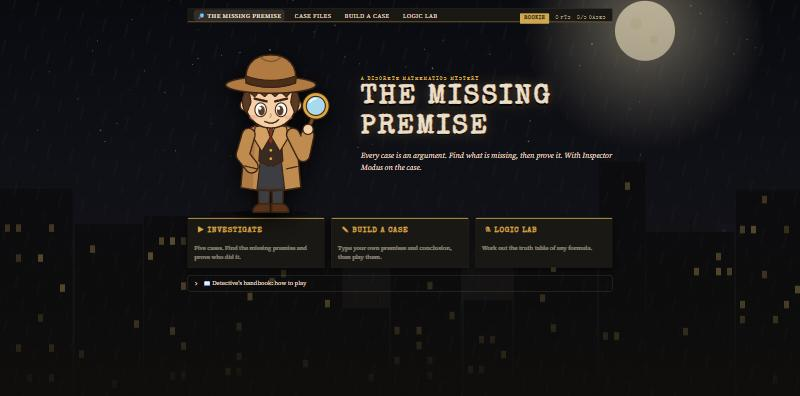
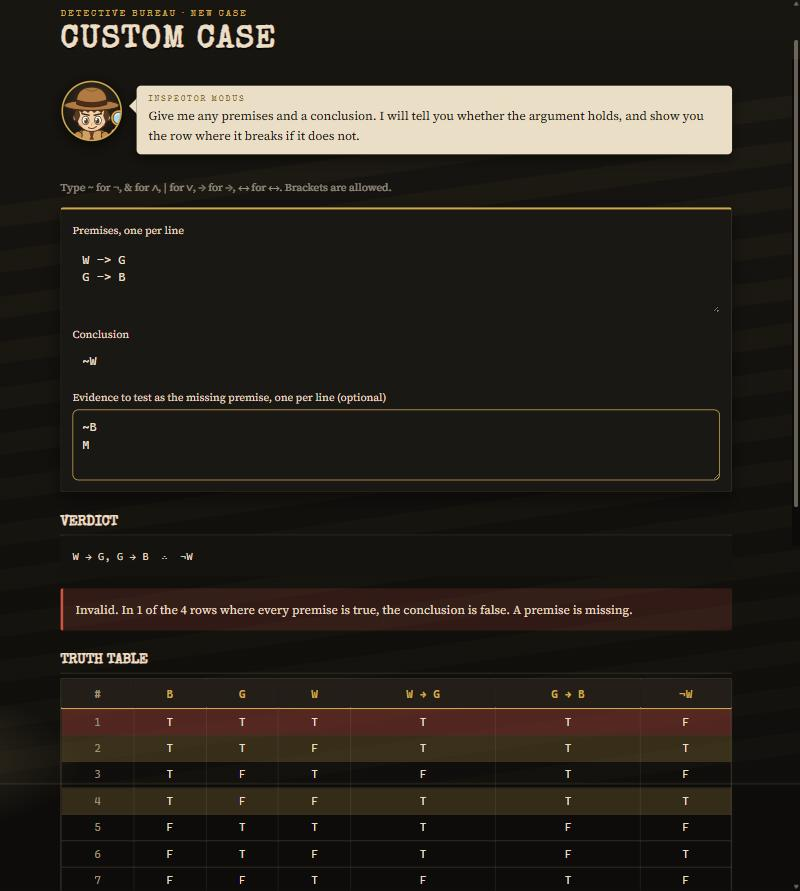
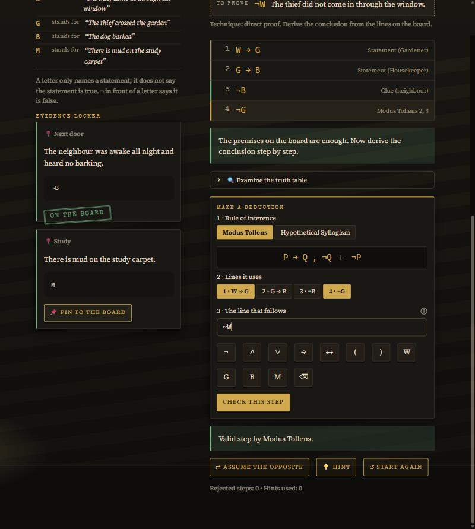
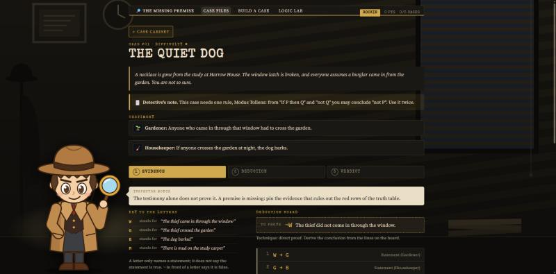

# The Missing Premise

A detective game where every case is an argument in propositional logic. Witness statements and evidence are the premises, the accusation is the conclusion, and the player has to find the premise that is missing and then prove the conclusion step by step with rules of inference.

**Play it online: https://themissingpremise.streamlit.app/** (if it has been idle it takes about a minute to wake up).



## Project details

| | |
| --- | --- |
| Course | Discrete Mathematics (7MA206), S.Y. B.Tech. (IT), ISE-2 |
| Live game | https://themissingpremise.streamlit.app/ |
| Team ID | TeeenTitans |
| Track | A: Gamified Application |
| Unit and topic | Unit I, Logic & Proof Techniques: propositional logic, truth tables, rules of inference, resolution |
| Platform and libraries | Python 3.10+, Streamlit (web GUI), pytest (tests) |
| Report | [report/ISE2_Technical_Summary_Report.pdf](report/ISE2_Technical_Summary_Report.pdf) (2 pages) |

## Team

| Roll no. | Name | GitHub | Module |
| --- | --- | --- | --- |
| 256109007 | Aritra Das | [@aritradas2005](https://github.com/aritradas2005) | Logic core (parser, evaluator, truth table, validity) and game logic (game state, hints, scoring, cases) |
| 256109015 | Prathmesh Khare | [@khareprathmesh14](https://github.com/khareprathmesh14) | Inference: rule checker, CNF, resolution, missing premise |
| 256109003 | Ganesh Chavan | [@killdog07](https://github.com/killdog07) | Screens and artwork: title screen, case screens, deduction board, custom case, truth table lab, styling |

## What you can do

- **Case files:** five cases of rising difficulty. Read the witness statements, find the evidence that is the missing premise, then prove the conclusion one checked step at a time. Each case opens when the one before it is solved.
- **Custom case:** type any premises and conclusion. You get the verdict, the truth table with counterexample rows marked, a resolution proof, a test of each typed clue as the missing premise, and the option to play your argument as a case.
- **Truth table lab:** type any formula to see its truth table worked out column by column, whether it is a tautology, a contradiction or a contingency, and whether it is equivalent to a second formula.

How this meets the three technical requirements of the brief:

| Requirement | Where |
| --- | --- |
| Graphical interface | A web GUI built with Streamlit: four screens, no command line |
| Dynamic user input | Any formula in the lab; any premises, conclusion and evidence on the custom case screen; nothing is hardcoded, and a typed case plays exactly like a written one |
| Step-by-step output | Truth tables with a column for every sub-formula; every proof line with its justification; each CNF rewrite; each resolution step |

## UI screenshots

| Custom case: typed input, verdict and truth table | A case in play: the proof so far and the step builder |
| --- | --- |
|  |  |



## Setup instructions

You need Python 3.10 or newer.

1. Get the code:

   ```bash
   git clone https://github.com/aritradas2005/theMissingPremise.git
   ```

   ```bash
   cd theMissingPremise
   ```

2. Install the two libraries (once):

   ```bash
   python -m pip install -r requirements.txt
   ```

3. Start the game:

   ```bash
   python -m streamlit run app.py
   ```

   It opens in your browser at http://localhost:8501. The first time, Streamlit may ask for an email address; press Enter to skip. After pulling new code, stop the game with Ctrl+C and start it again.

4. Run the tests (optional):

   ```bash
   python -m pytest
   ```

## How to play

1. **Read the testimony.** The witness statements are your premises, already on the deduction board.
2. **Find the missing premise.** The statements alone never prove the conclusion. The truth table shows the rows where they are all true and the conclusion is false. Pin the evidence that rules those rows out.
3. **Prove it.** Pick a rule of inference, the lines it uses, and write the new line. Every step is checked. Derive the conclusion (direct proof), or assume its opposite and derive a formula together with its negation (proof by contradiction).
4. **Score.** A solved case is worth 100 points, less 10 for each rejected step, 15 for each hint and 10 for each piece of evidence the argument did not need.

## Writing formulas

| Connective | Symbol | You can also type |
| --- | --- | --- |
| not | ¬ | `~` `!` |
| and | ∧ | `&` `^` |
| or | ∨ | `\|` |
| implies | → | `->` `=>` |
| if and only if | ↔ | `<->` `<=>` |

Atom names start with a letter: `P`, `Q`, `Butler_Lied`. From tightest to loosest the connectives bind as ¬, ∧, ∨, →, ↔, and `P -> Q -> R` means `P -> (Q -> R)`. A formula may use up to 8 different atoms.

## Proof techniques covered

| Technique | Where |
| --- | --- |
| Direct proof | Deduction board: premises to conclusion, one rule of inference per step |
| Proof by contradiction | Deduction board, "assume the opposite"; also the automatic resolution proof |
| Proof by contraposition | The Contraposition rule: from P → Q conclude ¬Q → ¬P |
| Proof by exhaustion | Truth table: every assignment is checked |
| Disproof by counterexample | Truth table rows where the premises are true and the conclusion is false |

## What is in this repository

```
app.py              the starting point: page setup and the bar at the top

SOURCE CODE, in three layers
engine/             LOGIC: all the mathematics, no screen code
  formula.py          what a formula is made of
  parser.py           typed text to formula, and formula back to text
  evaluator.py        the truth value of a formula under one assignment
  truth_table.py      every assignment
  validity.py         tautology, equivalence, valid argument
  rules.py            the nine rules of inference, one small checker each
  cnf.py              conversion to conjunctive normal form, step by step
  resolution.py       automatic proof by resolution
  missing_premise.py  consistency, the missing premise, the lying witness
game/               GAME: the rules of play, no screen code
  case_loader.py      reading and checking case files; building a typed case
  game_state.py       the proof so far, the evidence, making a step
  hints.py            which evidence to look at, which rule to try
  scoring.py          points, stars and rank
ui/                 SCREENS: drawing only, no logic (see ui/__init__.py for a list)
  home.py, case_files.py, custom_case.py, truth_table_lab.py    the four screens
  board.py, step_builder.py, session.py and others              shared pieces
  style.css, art/                                               the look and the pictures

DATA
data/cases/         the five cases, one JSON file each, listed in index.json

TEST DATA AND TESTS
test_data/          sample arguments, formulas and malformed inputs with the expected answers
tests/              304 automated tests, one file per module

DOCUMENTS
screenshots/        UI screenshots
report/             the two-page technical summary report (PDF)
tools/make_art.py   the script that draws the backgrounds and the detective
```

The screens call the game layer, the game layer calls the logic layer, and the logic layer knows nothing about either. That is why the logic can be tested on its own.

## How the code works, in plain words

Follow one click to see how the layers fit together. Suppose the player has chosen Modus Tollens and lines 2 and 3, typed `~G`, and pressed **Check this step**:

1. `ui/step_builder.py`, `submit_step`: collects the three choices and hands them to the game.
2. `game/game_state.py`, `attempt_step`: finds lines 2 and 3 on the board.
3. `engine/parser.py`, `parse`: turns the typed text `~G` into a formula. If it is malformed, the player gets a message saying where.
4. `engine/rules.py`, `check_step`: looks up the checker for Modus Tollens and asks it whether `¬G` really follows from those two lines.
5. Back in `attempt_step`: a correct step becomes line 4 with the note "Modus Tollens 2, 3"; a wrong one counts as a mistake and its reason is shown.
6. Streamlit draws the screen again from the game's new state.

Where to look for the mathematics:

| To see how... | Read |
| --- | --- |
| a truth table is built | `engine/truth_table.py` |
| an argument is tested for validity | `check_argument` in `engine/validity.py` |
| the missing premise is found | `try_candidates` in `engine/missing_premise.py` |
| a rule of inference is checked | the `check_...` functions in `engine/rules.py` |
| a resolution proof is made | `engine/cnf.py`, then `engine/resolution.py` |

## Test data

- `test_data/arguments.json`: 16 arguments, each marked valid or invalid, with a counterexample for the invalid ones. It includes the standard rules, three well-known fallacies and three edge cases (no premises, contradictory premises).
- `test_data/formulas.json`: formulas with the kind each is (tautology, contradiction, contingency) and how many rows make it true.
- `test_data/malformed_input.json`: bad input with the exact message and position the player should see.
- `data/cases/`: the five cases. The tests check that each is unsolved without its evidence and solvable with it, and play each one through with a written solution.

`tests/test_data_files.py` runs the logic on every entry and compares the answer with the file.

## Case files

A case is a JSON file in `data/cases/`, listed in `data/cases/index.json`. See `data/cases/case-01.json` for a complete example.

| Field | Meaning |
| --- | --- |
| `atoms` | each atom and what it means in English |
| `statements` | what the witnesses say, each with its formula |
| `clues` | evidence found at the scene; some closes the gap, some is a distraction |
| `conclusion` | what the detective must prove |
| `rules` | the rules of inference the player may use |
| `tip` | optional: a note from the detective shown at the top of the case |

The file does not say which piece of evidence is the missing premise. The logic works that out, so a case typed in on the custom case screen plays the same way as a written one.
