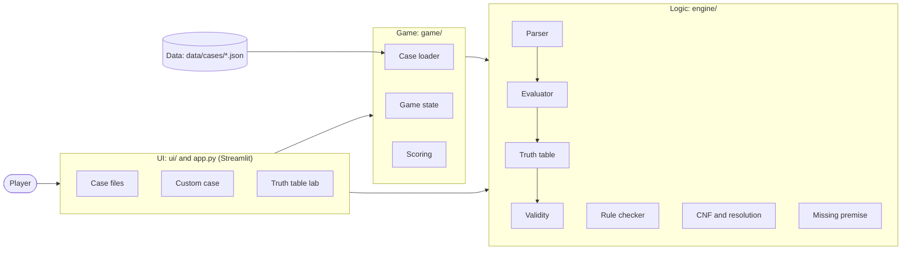

# ISE-2 Technical Summary Report (draft)

Draft of the 2-page report. Parts marked **TODO** need a teammate, a screenshot or a detail only the team knows. Sections 4 (steps 5 and 6) and 5 describe the inference and game modules as designed; revise them if anything is cut. Export to PDF and check it fits on two pages.

## 1. Project details

| | |
| --- | --- |
| Title | The Missing Premise |
| Team ID | **TODO** |
| Track | A: Gamified Application |
| Syllabus unit and topic | Unit I: Logic & Proof Techniques. Propositional logic, truth tables, rules of inference, resolution |
| GitHub repository | https://github.com/aritradas2005/theMissingPremise |
| Platform and libraries | Python 3.10+, Streamlit (web GUI), pytest (tests) |

## 2. Team members

| Roll no. | Name | Role | Contribution |
| --- | --- | --- | --- |
| 256109007 | Aritra Das | Logic core | **TODO** % |
| 256109015 | Prathmesh Khare | Inference | **TODO** % |
| 256109003 | Ganesh Chavan | Game and UI | **TODO** % |

Percentages must total 100%.

## 3. Problem statement and objective

The Missing Premise is a detective game for students learning propositional logic. Each case is an argument: witness statements and clues are premises, and the accusation is the conclusion. The statements alone do not prove the conclusion; the player must find the clue that closes the gap (the missing premise) and then prove the conclusion step by step with rules of inference. Any premises and conclusion can also be typed in on the custom case screen. The game demonstrates truth tables, logical equivalence, validity of arguments, rules of inference, resolution, and proof by direct derivation, contradiction and contraposition.

## 4. Mathematical formulation

**Formulas.** Built from atoms P, Q, … with ¬, ∧, ∨, →, ↔. Binding strength, tightest first: ¬, ∧, ∨, →, ↔; → groups to the right.

**Truth table.** An assignment gives each of the n atoms a value in {T, F}; there are 2ⁿ assignments. A formula is a *tautology* if true under all of them, a *contradiction* if false under all, otherwise a *contingency*. A ≡ B when A and B agree under every assignment.

**Validity.** The argument P₁, …, Pₙ ∴ C is valid iff (P₁ ∧ … ∧ Pₙ) → C is a tautology. A *critical row* is one where every premise is true; a *counterexample* is a critical row where C is false. Valid means no counterexamples.

**Missing premise.** For an invalid argument, a clue M is the missing premise when P₁, …, Pₙ, M ∴ C is valid and the premises with M are *consistent* (at least one critical row remains).

**Rules of inference.** Modus Ponens (P → Q, P ⊢ Q), Modus Tollens (P → Q, ¬Q ⊢ ¬P), Hypothetical Syllogism (P → Q, Q → R ⊢ P → R), Disjunctive Syllogism (P ∨ Q, ¬P ⊢ Q), Addition, Simplification, Conjunction, Resolution (P ∨ Q, ¬P ∨ R ⊢ Q ∨ R), Contraposition (P → Q ⊢ ¬Q → ¬P).

**Algorithm.**

1. Tokenize each typed formula and parse it into a tree by recursive descent, one function per precedence level; report malformed input with its position.
2. Collect the n atoms of the premises and conclusion and enumerate the 2ⁿ assignments.
3. Evaluate every premise and the conclusion on each row.
4. Mark the critical rows. The argument is valid iff no critical row has a false conclusion; otherwise show the counterexample rows.
5. For an invalid argument, test each unused clue M as an extra premise: it is the missing premise if it removes every counterexample and leaves a critical row.
6. Check each proof step the player enters against the pattern of the chosen rule; accept it as a new numbered line or reject it with a reason. The case is solved when the conclusion is derived (direct proof), or a formula and its negation are derived after assuming ¬C (proof by contradiction).

## 5. Software architecture

- **UI** (`ui/`, `app.py`): the Streamlit screens. Takes typed formulas and button clicks, draws tables and proofs. No logic.
- **Game** (`game/`): loads and validates case files, holds the proof lines, clues and mistakes of the case in play, and computes the score.
- **Logic** (`engine/`): all the mathematics as plain functions with no screen code, so it is tested on its own.
- **Data** (`data/cases/`): one JSON file per case. The file does not say which clue is the missing premise; the engine works it out.

## 6. Key UI screenshots

**TODO** (Game and UI owner): choose two screenshots and give each a one-line caption. Five are already saved in `docs/screenshots/` (`title-screen`, `case-cabinet`, `case-screen`, `case-closed`, `custom-case`); they are 800 pixels wide, so retake them at full size if they look soft in print.

1. An input screen, e.g. the custom case screen with premises typed in.
2. A step-by-step output screen, e.g. the deduction board mid-proof or a truth table with counterexample rows marked.

## 7. Testing and edge cases

Automated tests: `python -m pytest`. The rows below are from the logic core and all pass. **TODO**: the other two owners may swap in rows from their modules.

| # | Input | Expected | Actual | Result |
| --- | --- | --- | --- | --- |
| 1 | P → Q, P ∴ Q | Valid, no counterexample | Valid, 1 critical row, 0 counterexamples | Pass |
| 2 | P → Q, Q ∴ P | Invalid, counterexample P = F, Q = T | Invalid, counterexample P = F, Q = T | Pass |
| 3 | W → G, G → B ∴ ¬W, then with clue ¬B added | Invalid, then valid | Invalid (W = G = B = T), then valid | Pass |
| 4 | Edge: no premises (∅) ∴ P ∨ ¬P, and ∅ ∴ P | Valid; invalid | Valid; invalid (P = F) | Pass |
| 5 | Edge: contradictory premises P, ¬P ∴ Q | Valid, with no critical rows | Valid, 0 critical rows | Pass |
| 6 | Edge: malformed input `(P & Q` | Error naming the problem and its position | "This bracket is never closed." at position 0 | Pass |
| 7 | Edge: a formula with 9 atoms | Rejected, limit is 8 | "…would need 512 rows. The limit is 8 atoms." | Pass |

## 8. Individual contribution

| Member | Built | Files and functions |
| --- | --- | --- |
| Aritra Das (Logic core) | Formula tree, parser with positioned error messages, formatter, evaluator, truth table builder, validity checks, their tests; repository setup and base plan | `engine/formula.py`; `engine/parser.py`: `tokenize`, `parse`, `format_formula`; `engine/evaluator.py`: `get_atoms`, `evaluate`, `get_subformulas`; `engine/truth_table.py`: `build_truth_table`; `engine/validity.py`: `classify`, `are_equivalent`, `check_argument`; `tests/test_parser.py`, `test_evaluator.py`, `test_truth_table.py`, `test_validity.py`, `test_cases.py` |
| Prathmesh Khare (Inference) | Rules of inference step checker (9 rules), CNF step-by-step converter and clause generator, automated proof by resolution refutation, missing premise search, liar detection, and their unit tests | `engine/rules.py`: `check_step`; `engine/cnf.py`: `to_cnf`, `to_clauses`; `engine/resolution.py`: `prove_by_resolution`; `engine/missing_premise.py`: `is_consistent`, `try_candidates`, `find_liars`; `tests/test_rules.py`, `test_cnf.py`, `test_resolution.py`, `test_missing_premise.py` |
| Ganesh Chavan (Game and UI) | Game screens, case loader & validator, game state transitions, scoring, deduction board, custom case playground, truth table lab, and UI tests | `game/`, `ui/`, `data/cases/` and their tests |

This table must match the GitHub commit history.

## 9. Conclusion and references

**Achieved.** A playable detective game with five cases, in which every step of the player's proof is checked by a rule checker and the missing premise is found by truth table; a custom case screen that gives a verdict, truth table and resolution proof for any typed argument; and a truth table lab for any formula. All automated tests pass.

**Limitation.** The game covers propositional logic only, and truth tables are capped at 8 atoms (256 rows) because the method is exponential in the number of atoms.

**Future enhancement.** Predicate logic with quantifiers, and an induction module, to cover the rest of Unit I.

**References.** **TODO**: the course's prescribed textbook. A standard one for this material is K. H. Rosen, *Discrete Mathematics and Its Applications*, McGraw-Hill, chapter 1 (logic and proofs); confirm the edition you actually used.
